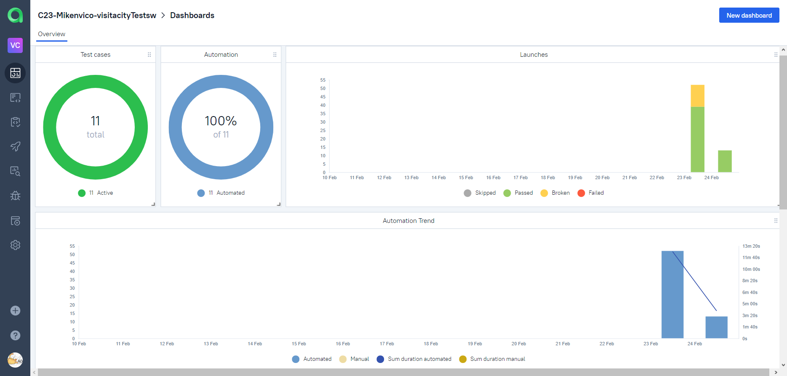
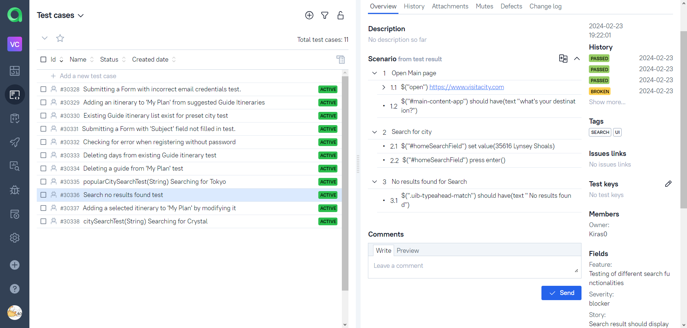
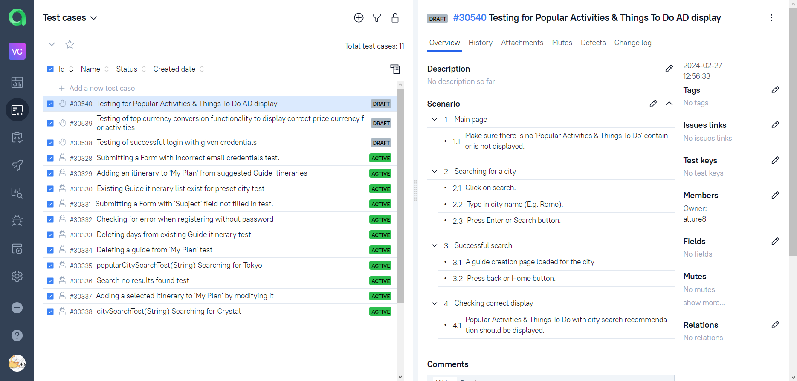
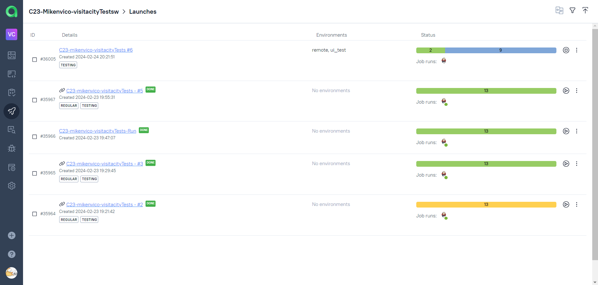
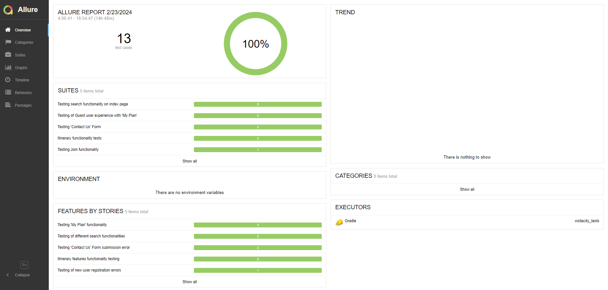
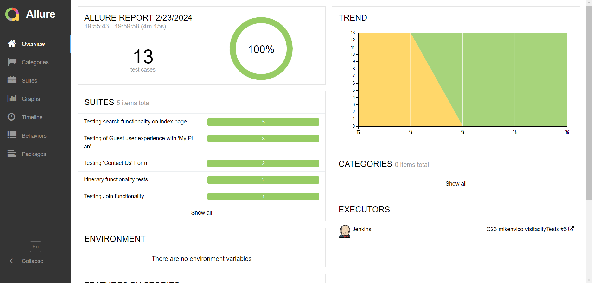
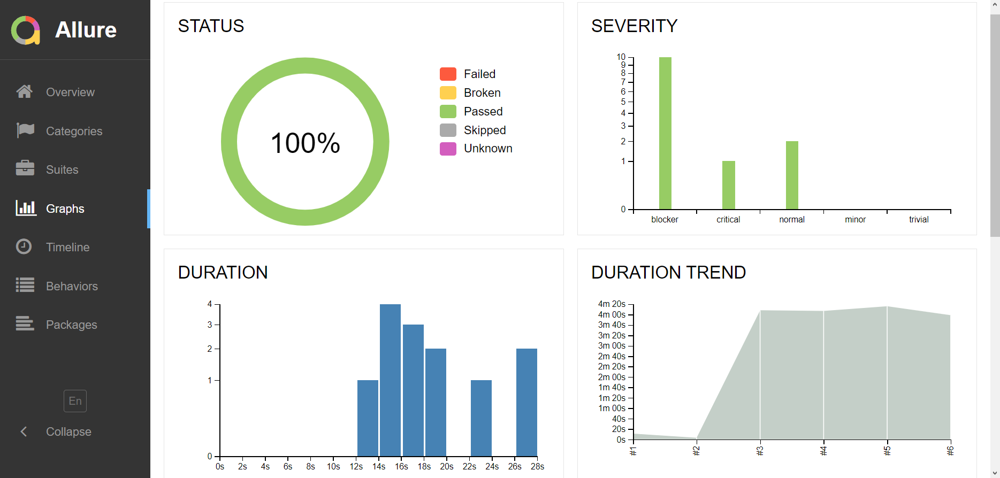
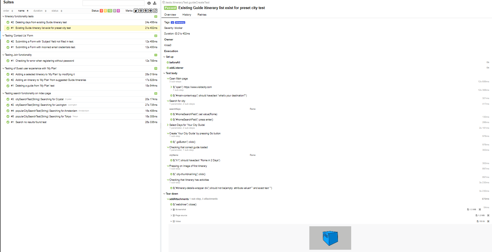
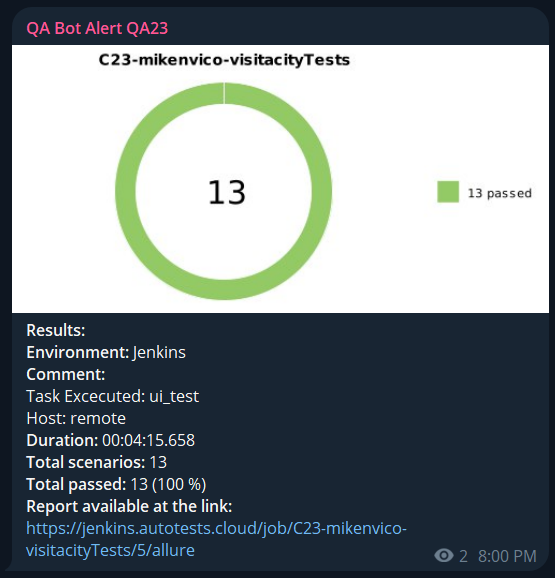
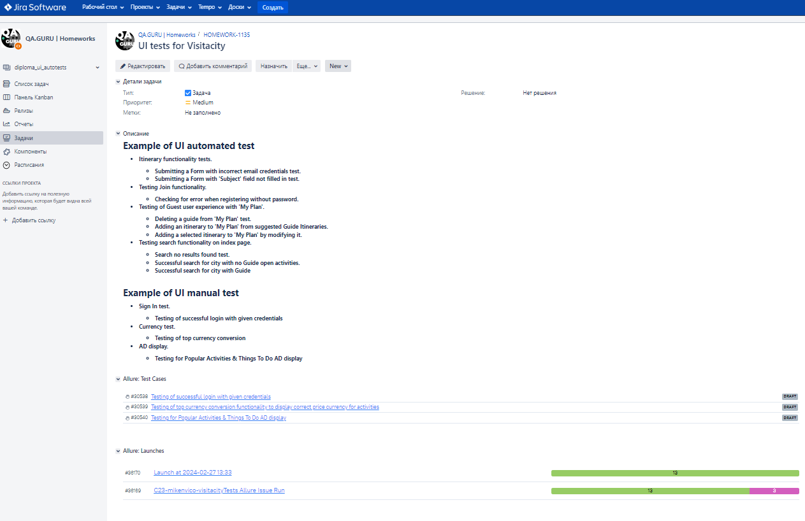

# <p align="center">Automated tests for [Visit A City](https://www.visitacity.com) website</p>

<p align="center" ><a href="https://www.visitacity.com">

</a></p>

## :link: Contents
- [Tools and Istruments](#tools-and-instruments)
- [Test Cases](#bookmark_tabs-test-cases)
- - [Automation Test](#desktop_computer-automated-tests)
- - [Manual Test](#hand-manual-test)
- [How to run the automated tests](#how-to-run-the-automated-tests)
- - [Local](#local)
- - [Using Jenkins](#satellite-remote)
- [Allure TestOps](#img-width4-titlejenkins-srcmediaimagesallure-testops-logosvg-allure-testops-integration)
- [Allure Reports](#img-width4-titlejenkins-srcmediaimagesallure-report-logosvg-allure-reports-integration)
- [Test Results](#ledger-test-results)
- - [Report](#example-of-a-run-report)
- - [Video](#img-width3-titleselenoide-srcmediaimagesselenoid-logosvg-video-of-the-test)
- - [Telegram](#img-width3-titletelegram-srcmediaimagestelegram-logosvg-telegram-test-result-notification)
- [Jira](#img-width4-titlejenkins-srcmediaimagesjira-logosvgjira-integration)


## 	:wrench: Tools and Instruments

<p  align="center">
  <code></code>
  <code></code>
  <code></code>
  <code></code>
  <code></code>
  <code></code>
  <code></code>
  <code></code>
  <code></code>
  <code></code>
  <code></code>
</p>

# :bookmark_tabs: Test Cases

## :desktop_computer: Automated Tests

- **Itinerary functionality tests.**
- - *Submitting a Form with incorrect email credentials test.*
- - *Submitting a Form with 'Subject' field not filled in test.*
- **Testing Join functionality.**
- - *Checking for error when registering without password.*
- **Testing of Guest user experience with 'My Plan'.**
- - *Deleting a guide from 'My Plan' test.*
- - *Adding an itinerary to 'My Plan' from suggested Guide Itineraries.*
- - *Adding a selected itinerary to 'My Plan' by modifying it.*
- **Testing search functionality on index page.**
- - *Search no results found test.*
- - *Successful search for city with no Guide open activities.*
- - *Successful search for city with Guide*

## :hand: Manual Test

- **Sign In test.**
- - *Testing of successful login with given credentials*
- **Currency test.**
- - *Testing of top currency conversion*
- **AD display.**
- - *Testing for Popular Activities & Things To Do AD display*


# :gear: How to run the automated tests

## :computer: Local

### Local Driver Test Run

To run the automated tests locally:
```bash
gradle clean test -Denv='local'
```
*Note: The following method will run the tests with the following parameters: (can be changed manually at src/test/resources/local.properties)*
+ Browser: **Google Chrome**
+ Browser version: **119.0**

### Local Selenoid UI Test Run 

To run the automated tests on Selenoid UI:
```bash
gradle clean test -Denv='remote'  
```
*Note: The following method will run the tests with the following default parameters: (can be changed manually at src/test/resources/remote.properties)*
+ Remote Url: **selenoid.autotests.cloud**
+ Browser: **Google Chrome**
+ Browser version: **100.0**

## :satellite: Remote

###  Using [Jenkins](https://jenkins.autotests.cloud/job/C23-mikenvico-visitacityTests/)

To run this test through Jenkins, press button :arrow_forward:<code>Build with Parameters</code>.\
You can see the results via Allure Reports, or use the link to Allure TestOps on the same page.
<p align="center">

</p>

###  Test Parameters
You can change the following parameters in the test:
+ <code>TASK</code> - Test to be executed. Default:<code>ui_test</code>
+ <code>ENV</code> - To set **local** or **remote** properties
+ <code>POPULAR_CITY</code> - Set default search city for tests (***Must be a popular city. E.g. Rome***).
<p align="center">

</p>

## [Allure TestOps](https://allure.autotests.cloud/project/4070/dashboards) Integration

### Dashboard

<p align="center">

</p>

---

### Automation Test Case

<p align="center">

</p>

### Manual Test Case

<p align="center">

</p>

---

### Launches

 <p align="center">
 
 </p>


## [Allure Reports](https://jenkins.autotests.cloud/job/C23-mikenvico-visitacityTests/allure/) Integration

### Local Allure Overview

<p align="center">

</p>

---

### Jenkins Allure Overview

<p align="center">

</p>

---

### Graphs

<p align="center">

</p>

## :ledger: Test Results

---

### Example of a Test Run report

> Allure Reports Provides a detailed step by step report of each test  user stories and test suites.\
> With each test result there is attached material such as test executed steps, screenshot, page source as well as a video.

<p align="center">

</p>

---

###  Video of the Test

> Example of Test and how Selenoid provides a video after each test.\
> Video of: Deleting days from existing Guide itinerary test

<p align="center">

</p>

---

###  Telegram test result notification

> After tests are finished Telegram Bot sends test result notification.

<p align="center">

</p>

---

## Jira Integration

<p align="center">

</p>
