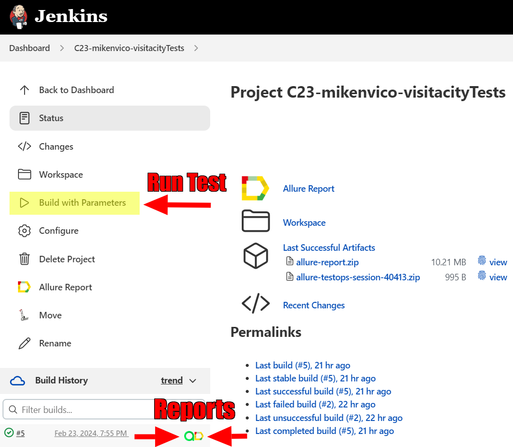
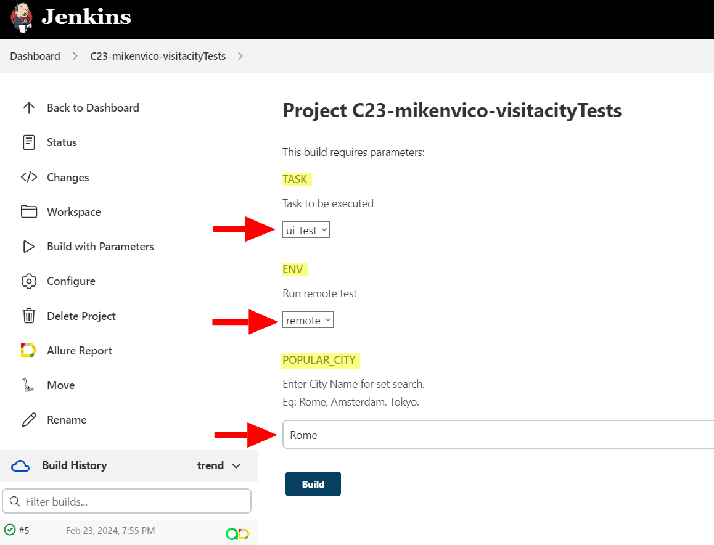

# <p align="center">Automated tests for Visit A City website</p>

<p align="center">
</p>

## :link: Contents
- [Tools and Istruments](#tools-and-instruments)
- [How to run the automated tests](#how-to-run-the-automated-tests)
- - [Local](#local)
- - [Using Jenkins](#satellite-remote)
- [Allure TestOps](#img-width4-titlejenkins-srcmediaimagesallure-testops-logosvg-allure-testops-integration)
- [Allure Reports](#img-width4-titlejenkins-srcmediaimagesallure-report-logosvg-allure-reports-integration)
- [Test Results](#ledger-test-results)
- - [Report](#example-of-a-run-report)
- - [Video](#img-width3-titleselenoide-srcmediaimagesselenoid-logosvg-video-of-the-test)
- - [Telegram](#img-width3-titletelegram-srcmediaimagestelegram-logosvg-telegram-test-result-notification)
- [Jira](#img-width4-titlejenkins-srcmediaimagesjira-logosvgjira-integration)


## 	:wrench: Tools and Instruments

<p  align="center">
  <code></code>
  <code></code>
  <code></code>
  <code></code>
  <code></code>
  <code></code>
  <code></code>
  <code></code>
  <code></code>
  <code></code>
  <code></code>
</p>

## :gear: How to run the automated tests

## :computer: Local

### Local Driver Test Run


To run the automated tests local:
```bash
gradle clean test -Denv='local'
```
*Note: The following method will run the tests with the following parameters: (can be changed manually at src/test/resources/local.properties)*
+ Browser: **Google Chrome**
+ Browser version: **119.0**
+ Browser size: **1920x1080**

### Local Selenoid UI Test Run 

To run the automated tests on Selenoid UI:
```bash
gradle clean test -Denv='remote'  
```
*Note: The following method will run the tests with the following default parameters: (can be changed manually at src/test/resources/remote.properties)*
+ Remote Url: **selenoid.autotests.cloud**
+ Browser: **Google Chrome**
+ Browser version: **100.0**
+ Browser size: **1920x1080**

## :satellite: Remote

###  Using [Jenkins](https://jenkins.autotests.cloud/job/C23-mikenvico-visitacityTests/)

To run this test through Jenkins, press button <code>:arrow_forward:Build with Parameters</code>.
You can see the results via Allure Reports, or use the link to Allure TestOps on the same page.
<p align="center">

</p>

###  Test Parameters
You can change the following parameters in the test:
+ <code>TASK</code> - Test to be executed. Default:<code>ui_test</code>
+ <code>ENV</code> - To set **local** or **remote** properties
+ <code>POPULAR_CITY</code> - Set default search city for tests (***Must be a popular city. E.g. Rome***).
<p align="center">

</p>

##  Allure TestOps Integration

##  Allure Reports Integration

## :ledger: Test Results

### Example of a Run report

###  Video of the Test

###  Telegram test result notification

## Jira Integration


